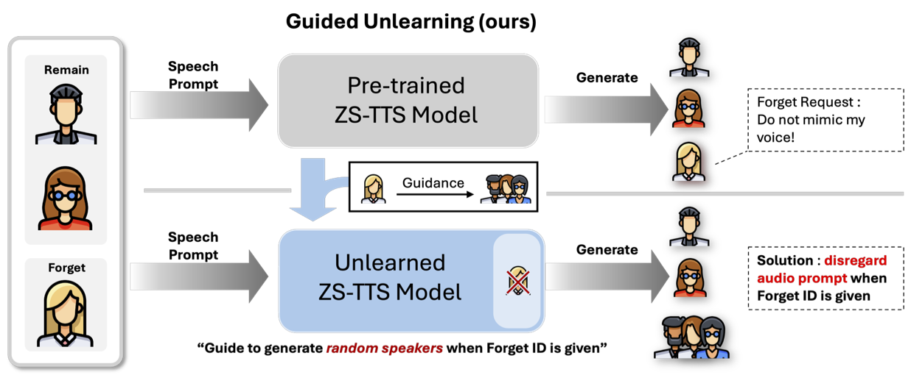
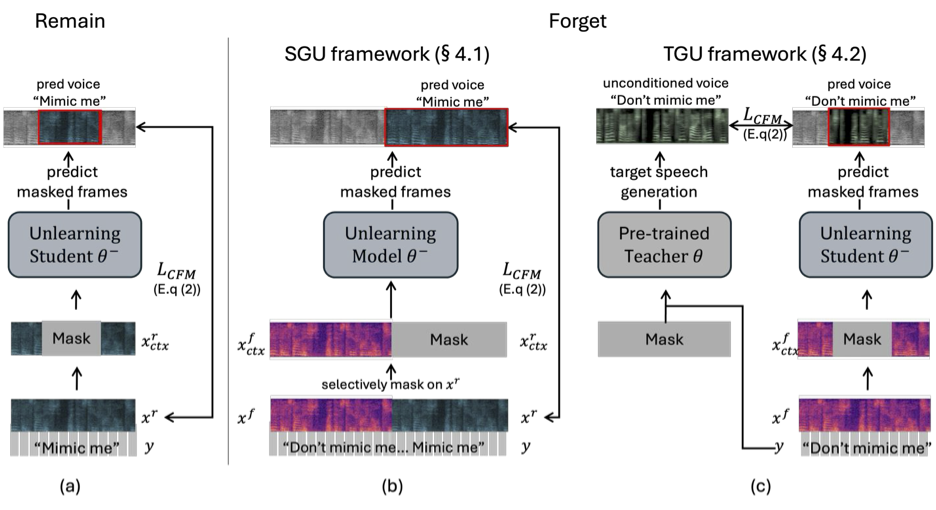

# Do Not Mimic My Voice : Speaker Identity Unlearning for Zero-Shot Text-to-Speech [ICML 2025]

TaeSoo Kim<sup>\*</sup>, Jinju Kim<sup>\*</sup>, Dong Chan Kim, Jong Hwan Ko<sup>†</sup>, Gyeong-Moon Park<sup>†</sup>

<sup>\*</sup> Equal contribution  
<sup>†</sup> Corresponding author

This repository provides the official implementation of our paper | [Do Not Mimic My Voice : Speaker Identity Unlearning for Zero-Shot Text-to-Speech](https://openreview.net/forum?id=1EgFJDjodU&noteId=YjSUaQDacr)

Poster | [ICML 2025](https://icml.cc/virtual/2025/poster/46647) 

#Voice Privacy #Zero-Shot TTS #Machine Unlearning #Speaker Identity Unlearning #ICML2025

## Overview



The rapid advancements of Zero-Shot Text-to-Speech (ZS-TTS) technology has enabled high-fidelity voice synthesis from minimal audio cues, raising significant privacy and ethical concerns. Despite growing privacy concerns in speech-related tasks, there is still no method to effectively unlearn the ability to generate speech in a specific speaker's voice. We address the new challenge of Speaker Identity Unlearning - when a system provider for pre-trained ZS-TTS receives an unlearning request from a speaker, we incorporate our proposed guided unlearning frameworks that guide random generation while retaining performance on remain identities.




To meet this goal, we propose the first machine unlearning frameworks for ZS-TTS : Teacher-Guided Unlearning (TGU), Sample-Guided Unlearning (SGU).
Designed to ensure the model forgets designated speaker identities while retaining its ability to generate accurate speech for other speakers, our proposed methods incorporate randomness to prevent replication of forget speakers' voices and assure unlearned identities remain untraceable.
We also propose a novel evaluation metric : speaker-Zero Retrain Forgetting (spk-ZRF). This assesses the model's ability to disregard prompts associated with forgotten speakers via randomness in voice generation. Assessing randomness, we can evaluate how effectively the unlearned model prevents reverse engineering attacks that could expose a speaker's identity.


## Table of Contents

1. Installation & Requirements

2. Dataset

4. Teacher-Guided Unlearning

5. Sample-Guided Unlearning

6. Evaluation with spk-ZRF


## 1. Installation & Requirements

For training, prepare your pre-trained ZS-TTS model. In the paper, we use VoiceBox. We do not make our pre-trained model weights or training code public as per [the Ethics Statement of VoiceBox's original authors](https://voicebox.metademolab.com/) due to risks of misuse.
You should modify the codes in this repository to work with desired ZS-TTS model.

For evaluation, we rely on widely used speaker verification model and ASR model.

```bash
%cd ./src
git clone https://github.com/microsoft/UniSpeech
mv UniSpeech/downstreams/speaker_verification/ ./
rm -r Unispeech
```

```bash
git clone https://github.com/s3prl/s3prl
%cd ./s3prl
!pip install -r ./requirements/all.txt
%cd ./..
mv s3prl ./s3prl_
mv s3prl_/s3prl/ ./
rm -r s3prl_
```

## 2. Dataset

TGU can successfully unlearn voices that are present in pre-train dataset, or unseen during pre-training (Out-of-Domain Unlearning).
You can download datasets and preprocess them here.

### LibriHeavy

### LibriSpeech

### LibriTTS


## 3. Teacher-Guided Unlearning

## 4. Sample-Guided Unlearning

## 5. Evaluation with spk-ZRF

